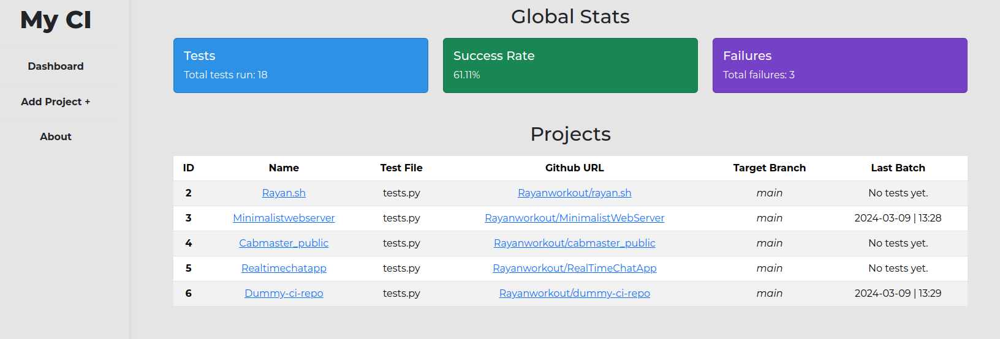

# A Minimalist CI Pipeline

Disclaimer: This project is not finished, and I may not continue its development. Everything is working but many features are still missing. Feel free to contribute to this project and / or adapt it to your needs._

## Demo

Demo deployment is available at https://simple-ci.rayan.sh/

## What is it ?
This small yet robust self hosted Continuous Integration system can be self-hosted on your server to run tests and monitor the results. It is designed to be simple to understand and easy to extend. Every part of the system is modular and can be replaced / extended with a different implementation. Every function is well documented and easy to understand.

The workflow is the following:

Github sends a webhook notification to the server when a new commit is pushed to the repository. The server then runs the tests on the specified branch and keeps track of the results. The results are then displayed on a web page.




The webhook is secured by a secret token that is shared between Github and the server. This ensures that only authorized users can trigger the pipeline.

See [this](https://docs.github.com/en/webhooks/using-webhooks/validating-webhook-deliveries) for more information on how to use and secure a webhook.

## Deployment

_Note: This CI system works under Linux only. Windows is not supported._

To install this project on your server, follow these steps:

Clone the repository in the directory of your choice
```bash
 git clone https://github.com/Rayanworkout/Simple-CI
```

Create a virtual environment and activate it
```bash
 cd Simple-CI
 python3 -m venv .venv
 source .venv/bin/activate
```
Install project dependancies
```bash
 pip install -r requirements.txt
```

## Environment Variables
Now you need to rename `.env.example` to `.env` and put inside the required environment variables.

Your secret keys can be arbitrary, just make sure to choose a strong key. You can easily generate one with a python shell:

```bash
>>> import secrets
>>> print(secrets.token_hex(24))
```
The `GITHUB_WEBHOOK_SECRET` must be created and used on all the projects you wish to monitor.

```bash
mv .env.example .env
nano .env
```

## Creating a webhook
To create a webhook for your project, just go to the github repository you wish to monitor, in `settings > webhooks > Add webhook`

The Payload URL is the address of your server and the port you chose, along with `/test` endpoint. The server will run on port **8080** by default.

For example, my server address is `http://194.135.81.27`. I will let the default port.

My Payload URL will be `http://194.135.81.27:8080/test`

The content-type must be `application/json`.

Then paste your secret token (same as `GITHUB_WEBHOOK_SECRET` in your `.env` file) and click Add webhook.

## Running the server

You should be good to go, now you just need to run the server on `0.0.0.0` host for it to be accessible everywhere (don't forget to open the necessary port of your server)

```bash
python3 main.py --host 0.0.0.0 --port 8080
```

You may now access your dashboard at `http://your_server_address:8080/`


## Things to consider

- It currently works with pytest only, but it can be easily extended to work with other testing frameworks.
- Your project needs to have a requirements.txt file at the root, containing all the dependencies of your project.
- Your test file must be at the root of the project, and not in a subdirectory.

- This project is for demonstration purposes only. It is not recommended to use it in a production environment without proper security measures.
- The server is not secured by default. You should consider using a reverse proxy with SSL termination to secure the server.
- The server is not optimized for performance. It is recommended to use a production-ready web server such as Apache or gunicorn to serve the application.


## How to use ?

Once the server is running and the webhook setup on github, each time you commit to the target branch specified, the server will pull all changes of your project, create a virtual environment, install the dependancies, and run the tests. The test results as well as some small statistics will be displayed on the dashboard.

You can add new projects in the add project tab, and specify the needed information. The repository will be cloned and added to the database.


## Contributing

Contributions are warmly welcomed. You can contribute by opening an issue or a pull request.
